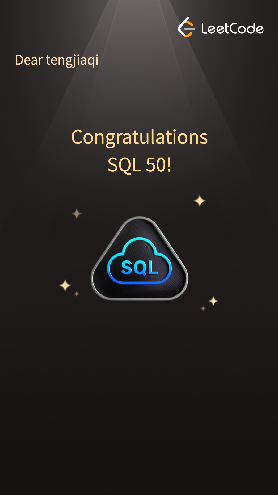

# Hi, I'm Helen (Yixuan Wang) 👋
Software Engineer | MS Computer Science @ Northeastern University (May 2026),
passionate about building scalable backend systems and applying ML to real-world problems.
My journey started at Coding Dojo in 2021, where I completed three full-stack tracks
in JavaScript, Java, and Python Django — and loved it enough to come back as a
Teaching Assistant in 2023.

## 🔧 What I Build
- **Distributed Systems** — microservices, replication, CAP theorem, RabbitMQ messaging
- **NLP & ML** — transformer fine-tuning (DeBERTa, RoBERTa), text classification
- **Full-Stack** — React, Vite, Express.js, MongoDB, MySQL, Django, FastAPI
- **LAMP Stack** — PHP, Apache, MySQL, Docker
- **Background Tasks** — Celery, BullMQ, Redis, automated scheduling
- **DevOps** — Docker, Kubernetes, HPA, AWS ECS Fargate, ALB, ECR, Railway, Vercel
- **AI & LLM APIs** — Anthropic Claude API, streaming responses, real-time token delivery

## 🛠️ Tech Stack

## 📌 Featured Projects
| Project | Description | Tech |
|---|---|---|
| [WebCrawler](https://webcrawler-liart.vercel.app) | Full-stack web crawler with BFS crawling, content extraction, change detection, scheduled re-crawls, and Kubernetes deployment with HPA — deployed on Railway + Vercel | FastAPI, Celery, Redis, PostgreSQL, React, Docker, Kubernetes |
| [Product Catalog API](https://github.com/Helenyixuanwang/product-catalog-api) | FastAPI REST API containerized with Docker, deployed to AWS ECS Fargate with Application Load Balancer across multiple Availability Zones — infrastructure managed via AWS CLI | FastAPI, Docker, AWS ECS, ECR, ALB, CloudWatch, Python |
| [Warehouse Dashboard](https://frontend-production-127d.up.railway.app) | Real-time warehouse task dashboard with priority job queue, background workers, retry with exponential backoff, and live status updates — deployed on Railway | NestJS, BullMQ, Redis, PostgreSQL, React, TypeScript, Material UI |
| [ClientPulse](https://client-pulse-psi.vercel.app) | Client project tracker with auth, per-user RLS, task management, and feedback board — deployed on Vercel | Next.js, TypeScript, Supabase, PostgreSQL, Tailwind CSS |
| [AI Chatbot](https://ai-chatbot-rho-nine-71.vercel.app) | Streaming AI assistant with real-time token delivery, multi-turn conversation history, and terminal dark UI — deployed on Vercel | Next.js, TypeScript, Tailwind CSS, Anthropic Claude API |
| [Classic Reads](https://classic-reads-livid.vercel.app) | Classic literature browser — search and read 70,000+ public domain books from Project Gutenberg | Vite, React, TypeScript, Tailwind CSS, Gutenberg API, Vercel |
| [Flavor Atlas](https://flavor-atlas.vercel.app) | Kid-friendly world food explorer — browse recipes by region & category with meal details and YouTube tutorials | Vite, React, TypeScript, Tailwind CSS, TheMealDB API, Vercel |
| [YA Books Explorer](https://ya-books-explorer.vercel.app) | Young Adult book discovery app — browse by genre, search by title or author, powered by Google Books API | Vite, React, TypeScript, Tailwind CSS, Google Books API, Vercel |
| [Job Tracker](https://job-tracker-production-4f92.up.railway.app) | Full-stack job tracker with auth, PDF export, REST API, Celery email summaries — deployed on Railway | Django, FastAPI, Celery, Redis, PostgreSQL, Docker |
| [History Heroes](https://history-heroes.vercel.app) | Kid-friendly biography explorer — famous people born on today's date, live Wikipedia API, daily rotating cards | Vite, React, JavaScript, Wikipedia API, Vercel |
| [E-Commerce Microservices](https://github.com/Helenyixuanwang/ecommerce-microservices) | 15-service system with RabbitMQ, AWS ECS Fargate, ALB | Java, Spring Boot, Docker, AWS |
| [Distributed KV Store](https://github.com/Helenyixuanwang/distributed-kv-store) | Leader-follower & leaderless replication with tunable W/R/N | Java, Docker |
| [Sudoku Dojo](https://yixuan-wang-project3-server.onrender.com) | Full-stack app with REST API, MongoDB Atlas, bcrypt auth | Node.js, Express, React, MongoDB |
| [SpendWise](https://github.com/Helenyixuanwang/spendwise) | LAMP expense tracker with MVC refactor branch and stored procedures | PHP, MySQL, Apache, Docker |
| LLM Paraphrase Detection | 4-way text classification with DeBERTa, ensemble methods | Python, HuggingFace |

## 🏆 Certifications

## 📍 Location
Vancouver, BC

## 📫 Let's Connect

